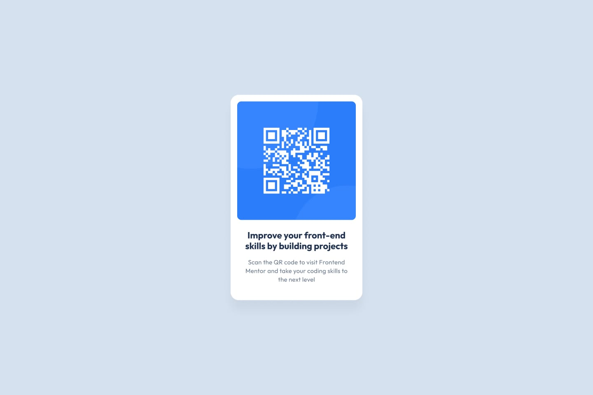

# Frontend Mentor - QR code component solution

This is a solution to the [QR code component challenge on Frontend Mentor](https://www.frontendmentor.io/challenges/qr-code-component-iux_sIO_H). Frontend Mentor challenges help you improve your coding skills by building realistic projects. 

## Table of contents

- [Overview](#overview)
  - [Screenshot](#screenshot)
  - [Links](#links)
- [My process](#my-process)
  - [Built with](#built-with)
  - [What I learned](#what-i-learned)

## Overview
This project is my first frontend challenge as a backend developer. I built a QR code card component using Tailwind CSS to learn fundamental frontend concepts like Flexbox, responsive design, and working with design systems. The simple scope allowed me to focus on understanding CSS layout and utility-first styling approach.

### Screenshot



### Links
- Live Site URL: [Add live site URL here](https://your-live-site-url.com)

## My process

### Built with

- Semantic HTML5 markup
- [Tailwind](https://cdn.tailwindcss.com)

### What I learned

## What I learned

As a backend developer who is new to frontend development, this project gave me many insights into modern web development. Here are the things I learned:

### 1. Using Tailwind CSS via CDN

I learned the fastest way to get started with Tailwind CSS without needing complex build tool setup. Just by adding one line of script:

```html
<script src="https://cdn.tailwindcss.com"></script>
```

This method is very practical for prototyping and learning, although for production later I will need to use a more proper installation.

### 2. Custom Tailwind Configuration

I learned that Tailwind is very flexible and can be customized according to the design system. For this project, I configured custom colors and font family according to the style guide:

```javascript
tailwind.config = {
  theme: {
    extend: {
      colors: {
        'slate-300': 'hsl(212, 45%, 89%)',
        'slate-500': 'hsl(216, 15%, 48%)',
        'slate-900': 'hsl(218, 44%, 22%)',
      },
      fontFamily: {
        'outfit': ['Outfit', 'sans-serif'],
      },
    }
  }
}
```

With this configuration, I can use custom colors like `bg-slate-300` or `text-slate-900` that have been adjusted to the HSL values from the design, and the Outfit font can be called with the `font-outfit` class. This makes the code more semantic and consistent with the design system.

### 3. Understanding Flexbox for Layout

This is the most powerful concept I learned. Flexbox makes centering and layout management very easy. Previously I didn't understand how to center elements in the middle of the screen, now I know how:

```html
<body class="flex items-center justify-center min-h-screen">
  <div class="card">...</div>
</body>
```

**Key concepts I understood:**
- `flex` - activates flexbox layout
- `items-center` - centers vertically (cross axis)
- `justify-center` - centers horizontally (main axis)
- `min-h-screen` - makes the container as tall as the viewport

The combination of these classes results in perfect centering without needing complicated CSS hacks!